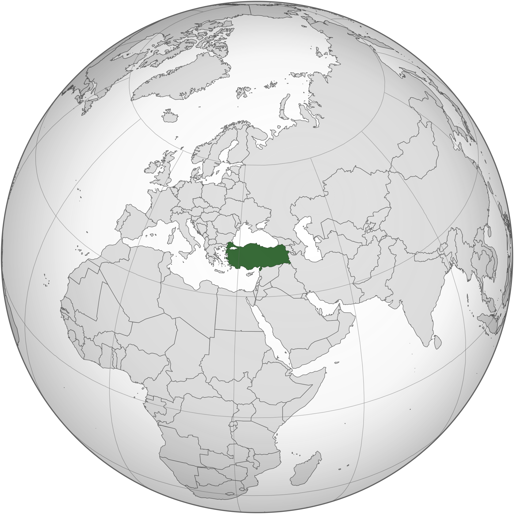
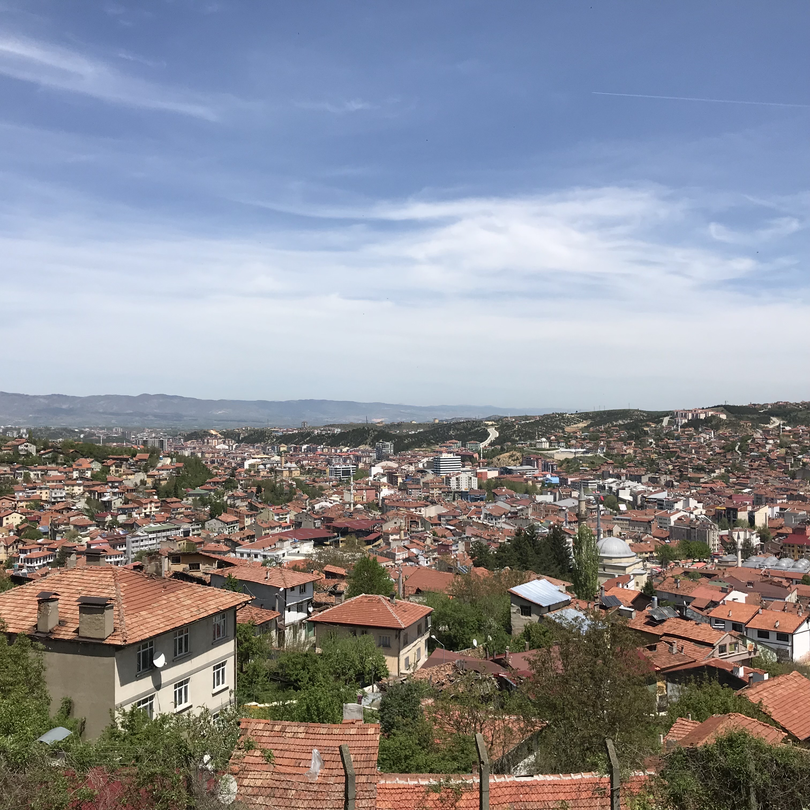
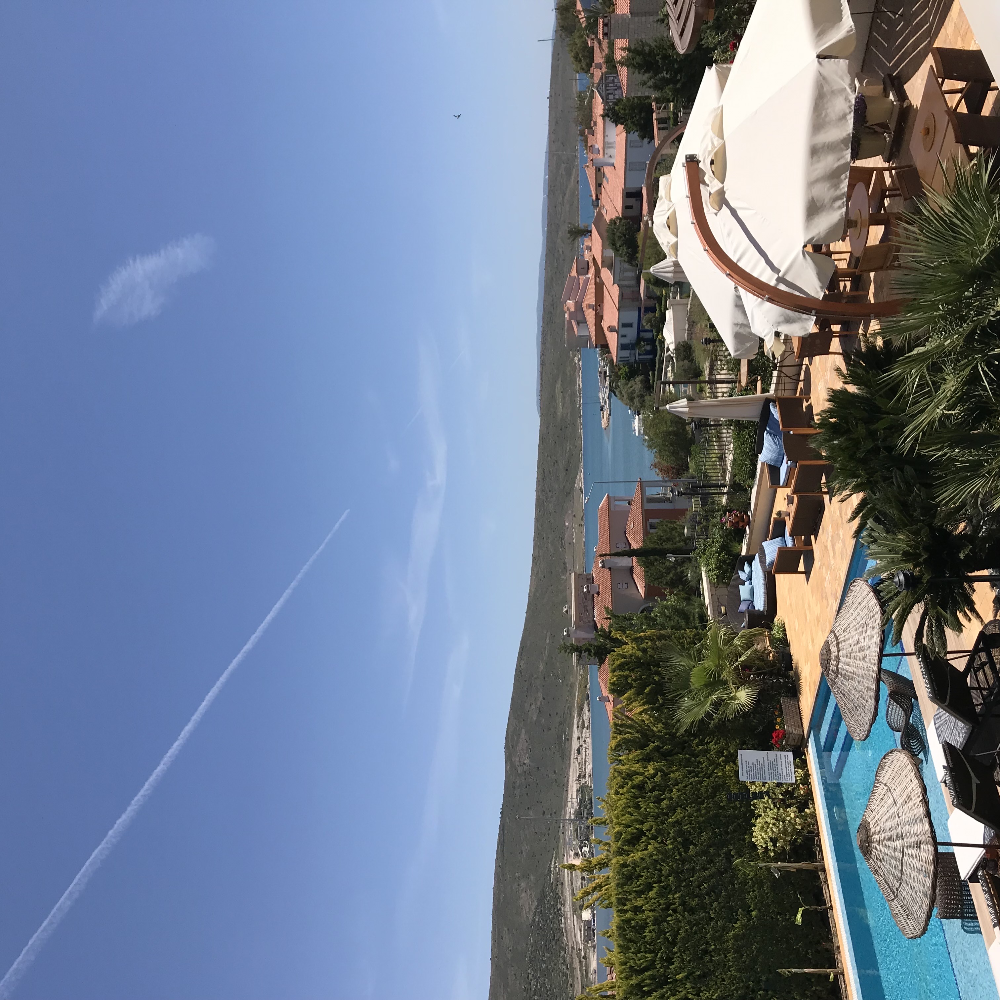
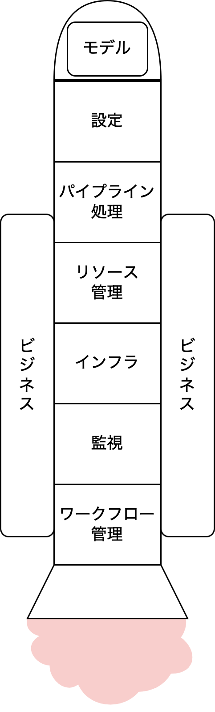
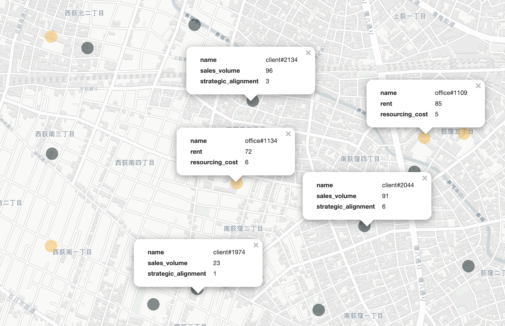
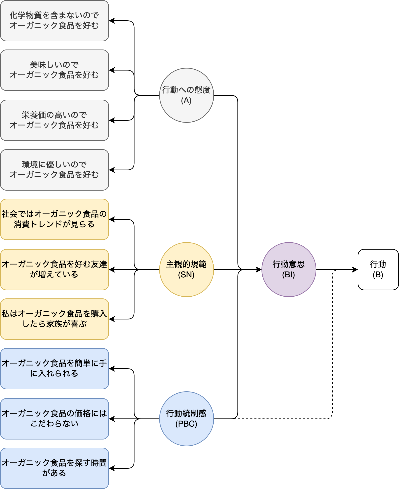

```{r load_packages, message=FALSE, warning=FALSE, include=FALSE} 
library(here)
library(DiagrammeR)
library(knitr)
```

<script src="https://code.jquery.com/jquery-3.6.0.min.js" integrity="sha256-/xUj+3OJU5yExlq6GSYGSHk7tPXikynS7ogEvDej/m4=" crossorigin="anonymous"></script>
<script src="https://cdnjs.cloudflare.com/ajax/libs/highlight.js/11.8.0/highlight.min.js"></script>
<link rel="stylesheet" href="https://cdnjs.cloudflare.com/ajax/libs/highlight.js/11.8.0/styles/tokyo-night-dark.min.css">
<script type='text/javascript' src='script/custom.js'></script>
<script src="https://cdnjs.cloudflare.com/ajax/libs/font-awesome/6.4.0/css/all.min.css"></script>

<!-- Enables HTML tags in nodes -->
<!-- <script>mermaid.initialize({ securityLevel: 'loose' });</script> -->

```{css, echo=FALSE}
pre {
  margin-left: 80px;
  width: 90%
}

ol, ul, p {
  font-size: 18px !important;
}

.alert {
  font-size: 18px !important;
}

th {
    text-align:left !important;
}
```

## 自己紹介

<table class="table">
<tr>
  <td></td>
  <td colspan="2">セルジャン・タハ・アヒ<br>
  1981年トルコ生まれ → 学位：中東工科大学 → 修士：中東工科大学 → 博士：東京工業大学<br>
  2011年〜現在、データサイエンスの領域で働いている</td>
</tr>
<tr>
  <td>赤とオレンジの色合いの家の屋根</td>
  <td>風光明媚なエーゲ海と地中海の海岸線沿いに位置する数多くのリゾート</td>
  <td>歴史的遺跡が豊富</td>
</tr>
<tr>
  <td></td>
  <td></td>
  <td></td>
</tr>
</table>

# Part-1: Intro

## データサイエンティスト vs 機械学習エンジニア

<center>
```{r, echo=FALSE}
fname <- here::here("mermaid", "ds_vs_ml.mmd")

DiagrammeR::mermaid(
  diagram = paste(readLines(fname), collapse="\n"),
  height = "65%",
  width = "70%")
```
</center>

## ML Systems

<center></center>

# Part-2: ?件のケーススタティ

## 離脱分析によるサービス改良

**タスク**: 顧客の離脱を防止し維持する方法の提案

## 離脱防止施策の例

<table class="table">
  <tr>
    <th>#</th>
    <th>対策方法</th>
    <th>詳細</th>
  </tr>
  <tr>
    <td>1</td>
    <td>アフターフォローのコミュニケーション</td>
    <td>前に購入した商品の使い勝手はどうか等のフォローアップとして連絡をとります。顧客に自分が大切にされていることや、一人ひとりを大切にしている自社の姿勢を理解してもらいます。</td>
  </tr>
  <tr>
    <td>2</td>
    <td>Offer Personalized Experiences</td>
    <td>Tailor products or services to meet individual customer needs, preferences, and expectations to foster a stronger connection and sense of value.</td>
  </tr>
  <tr>
    <td>3</td>
    <td>ロイヤルティプログラムを導入する</td>
    <td>Reward customers for their continued business with incentives, discounts, exclusive offers, or loyalty points to encourage ongoing engagement and repeat purchases.</td>
  </tr>
  <tr>
    <td>4</td>
    <td>顧客からのフィードバックを定期的に求める</td>
    <td>Proactively collect customer feedback through surveys, interviews, or feedback channels to identify areas for improvement and address any concerns or dissatisfaction.</td>
  </tr>
  <tr>
    <td>5</td>
    <td>Provide Ongoing Value and Engagement</td>
    <td>Continuously deliver value through regular product updates, relevant content, educational resources, or community engagement to keep customers actively involved and invested in your offerings.</td>
  </tr>
</table>

## TV番組の放送時間の最適化による視聴率の増加

**タスク**: Maximize viewership by budget, scheduling, and viewers' availability constraints

<table class="table">
  <tr>
    <th>Time</th>
    <th>Monday</th>
    <th>Tuesday</th>
    <th>Wednesday</th>
    <th>Thursday</th>
    <th>Friday</th>
  </tr>
  <tr>
    <td>8:00-12:00</td>
    <td>The Big Bang Theory</td>
    <td>Friends</td>
    <td>Grey's Anatomy</td>
    <td>Breaking Bad</td>
    <td>The Office</td>
  </tr>
  <tr>
    <td>12:00-13:00</td>
    <td>Game of Thrones</td>
    <td>Stranger Things</td>
    <td>NCIS</td>
    <td>The Walking Dead</td>
    <td>Black Mirror</td>
  </tr>
  <tr>
    <td>13:00-15:00</td>
    <td>Law & Order: SVU</td>
    <td>The Crown</td>
    <td>CSI: Crime Scene Investigation</td>
    <td>How to Get Away with Murder</td>
    <td>Money Heist</td>
  </tr>
  <tr>
    <td>15:00-17:00</td>
    <td>The Simpsons</td>
    <td>Friends</td>
    <td>Grey's Anatomy</td>
    <td>The Big Bang Theory</td>
    <td>Breaking Bad</td>
  </tr>
  <tr>
    <td>17:00-19:00</td>
    <td>Stranger Things</td>
    <td>The Office</td>
    <td>Black Mirror</td>
    <td>Game of Thrones</td>
    <td>The Crown</td>
  </tr>
  <tr>
    <td>19:00-21:00</td>
    <td>NCIS</td>
    <td>Money Heist</td>
    <td>Law & Order: SVU</td>
    <td>The Walking Dead</td>
    <td>CSI: Crime Scene Investigation</td>
  </tr>
  <tr>
    <td>21:00-24:00</td>
    <td>How to Get Away with Murder</td>
    <td>The Big Bang Theory</td>
    <td>Grey's Anatomy</td>
    <td>Friends</td>
    <td>Breaking Bad</td>
  </tr>
</table>

## 事業拡大計画の策定

**タスク**: Minimize the distance to existing customers by renting nearby offices under rental and resourcing constraints, and current and future sales forecasts

<center></center>

## ユーザーの支出に対する障壁の特定

**タスク**: 購入の障壁を予測し、その障壁を取り除く販促政策を策定

<table class="table">
  <tr>
    <td width="280">オーガニック食品を販売している会社の<br>観点から考える<br><br>
    1. 計画的行動理論を元に要因を考える<br>
    2. アンケートを実施<br>
    3. 共分散構造分析（SEM）を実行<br>
    4. モデルの確認<br>
    5. 結論を抽出し、政策を具体的化
    </td>
    <td><center></center></td>
  <tr>
</table>

## 4. ソーシャル・ネットワーク分析

# Part-3

## 機械学習モデルとは？

## 書籍

## データサイエンティストのキャリア

## Years vs Tooling

```{r, echo=FALSE}
fname <- here::here("mermaid", "tooling_timeline.mmd")

DiagrammeR::mermaid(
  diagram = paste(readLines(fname), collapse="\n"),
  height = "100%",
  width = "100%")
```

## データサイエンスの今後

# Thank you
