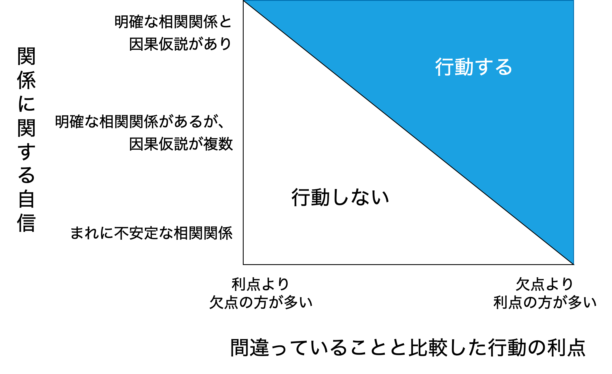
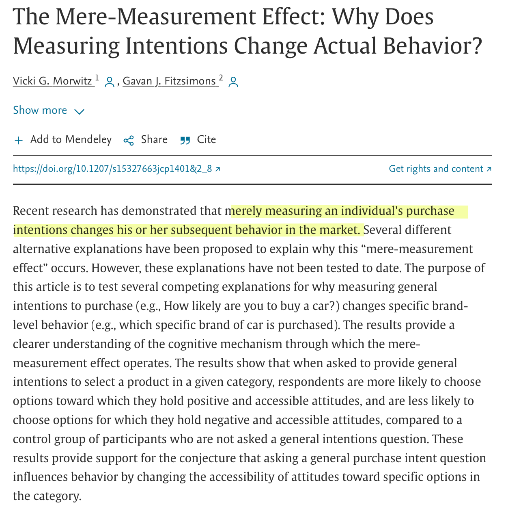
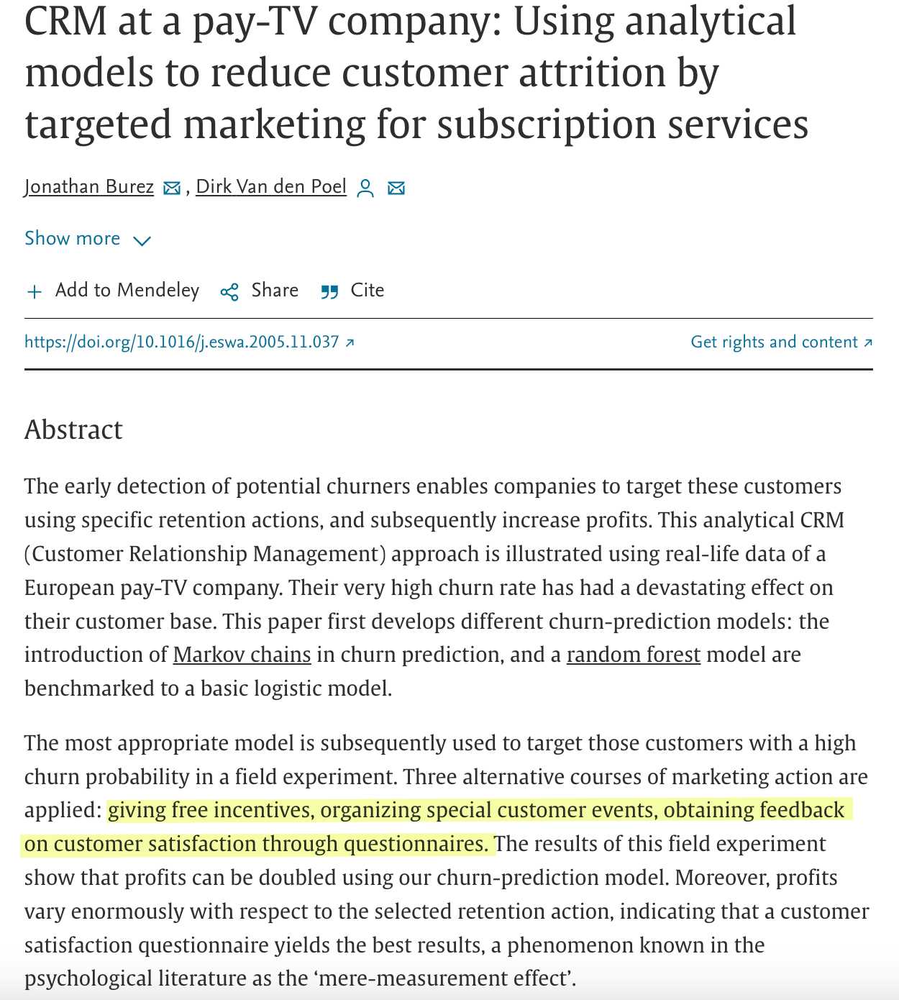

```{r load_packages, message=FALSE, warning=FALSE, include=FALSE} 
library(here)
library(DiagrammeR)
library(knitr)
library(kableExtra)
library(data.table)
library(magrittr)
```

<script src="https://code.jquery.com/jquery-3.6.0.min.js"></script>
<script src="https://cdnjs.cloudflare.com/ajax/libs/highlight.js/11.8.0/highlight.min.js"></script>
<script type='text/javascript' src='script/custom.js'></script>
<script src="https://cdnjs.cloudflare.com/ajax/libs/font-awesome/6.4.0/css/all.min.css"></script>
<link rel="stylesheet" href="https://cdnjs.cloudflare.com/ajax/libs/highlight.js/11.8.0/styles/tokyo-night-dark.min.css">

<!-- Enables HTML tags in nodes -->
<!-- <script>mermaid.initialize({ securityLevel: 'loose' });</script> -->

```{css, echo=FALSE}
slides > backdrop {
  background: white;
}

slides > slide {
  background: linear-gradient(#ffffff, #ffffff 85%, #ffffff);
  background-color: white;
}
```

## 自己紹介

<table class="table">
<tr>
  <td></td>
  <td colspan="2">セルジャン・タハ・アヒ<br>
  1981年トルコ生まれ → 学位：中東工科大学 → 修士：中東工科大学 → 博士：東京工業大学<br>
  2011年〜現在、データサイエンスの領域で働いている</td>
</tr>
<tr>
  <td>赤とオレンジの色合いの家の屋根</td>
  <td>風光明媚なエーゲ海と地中海の海岸線沿いに位置する数多くのリゾート</td>
  <td>歴史的遺跡が豊富</td>
</tr>
<tr>
  <td></td>
  <td></td>
  <td></td>
</tr>
</table>

# データサイエンスの原則

## (1) データサイエンスと機械学習ことなる

<center>
```{r, echo=FALSE}
fname <- here::here("mermaid", "ds_vs_ml.mmd")

DiagrammeR::mermaid(
  diagram = paste(readLines(fname), collapse="\n"),
  height = "60%",
  width = "60%")
```
</center>

## (2) データサイエンスは解決のごく一部に過ぎない

<center></center>

## (3) 羅生門効果がデータサイエンスにもある

<div class="alert alert-warning">
羅生門効果とは、一つの出来事において、人々がそれぞれに見解を主張すると矛盾してしまう現象のこと
</div>

データサイエンスにおける羅生門効果とは、同じデータセットの異なる解釈や分析によって対照的な、あるいは矛盾した結論が導き出されること。

<center>

<br>
<font size="3">
羅生門効果は、黒澤明監督の映画「羅生門」で名付けられる
</font>
</center>

## (4) オッカムの剃刀

<div class="alert alert-warning">
オッカムの剃刀とは、ある事柄を説明するためには、必要以上に多くを仮定するべきでないとする指針
</div>

データサイエンスにおけるオッカムの剃刀は、複数の仮説や説明が与えられた場合に、最もシンプルで最も少ない仮説や説明を選ぶ原則です。

<center>

<br>
<font size="3">
オッカムの剃刀は、14世紀の哲学者・神学者のオッカムが多用したことで有名になった
</font>
</center>

## (5) 相関関係だけで十分な場合もある

<div class="alert alert-warning">
相関関係は因果関係を意味しないが、行動するためには、相関関係だけで十分な場合がある
</div>

- 相関関係は、2つの変数間の関連性や一緒に変動する傾向を示す
- 因果関係は、ある変数の変化が別の変数に直接的な影響を与える関係

<center>
<font size="3">
相関関係に基づいて行動すべき場合とそうでない場合
</font>
<br>

<br>
<font size="3">
[David Ritter, BCG](https://www.bcg.com/publications/2014/information-technology-future-strategy-david-ritter-when-act-correlation-when-not)
</font>
</center>

# ケーススタティ

## 1. 離脱分析によるサービス改良

**タスク**: 顧客の離脱を防止し維持する方法を提案してください

顧客満足度の向上及び離脱の予防は、企業にとって重要な経営目標だ。主な理由が二つがある。

1. 新規顧客を獲得するには、既存の顧客を維持するよりも費用がかかる
2. 新規顧客の収益は既存顧客よりも少ない

## 離脱防止施策の例

<table class="table">
  <tr>
    <th>#</th>
    <th>対策方法</th>
    <th>詳細</th>
  </tr>
  <tr>
    <td>1</td>
    <td>アフターフォローのコミュニケーション</td>
    <td>前に購入した商品の使い勝手はどうか等のフォローアップとして連絡をとります。顧客に自分が大切にされていることや、一人ひとりを大切にしている自社の姿勢を理解してもらいます。</td>
  </tr>
  <tr>
    <td>2</td>
    <td>Offer Personalized Experiences</td>
    <td>Tailor products or services to meet individual customer needs, preferences, and expectations to foster a stronger connection and sense of value.</td>
  </tr>
  <tr>
    <td>3</td>
    <td>ロイヤルティプログラムを導入する</td>
    <td>Reward customers for their continued business with incentives, discounts, exclusive offers, or loyalty points to encourage ongoing engagement and repeat purchases.</td>
  </tr>
  <tr>
    <td>4</td>
    <td>顧客からのフィードバックを定期的に求める</td>
    <td>Proactively collect customer feedback through surveys, interviews, or feedback channels to identify areas for improvement and address any concerns or dissatisfaction.</td>
  </tr>
  <tr>
    <td>5</td>
    <td>Provide Ongoing Value and Engagement</td>
    <td>Continuously deliver value through regular product updates, relevant content, educational resources, or community engagement to keep customers actively involved and invested in your offerings.</td>
  </tr>
</table>

## Fun Fact about 離脱防止施策

<div class="alert alert-warning">
<font size="3">
心理学には「単純計測効果」という理論がある。その理論によれば、消費やオンラインサービス利用の全般に関してアンケートに回答すると回答しているうちに、対象の商品やサービスを好ましく感じて、購入・消費・利用意欲が高まる効果があるとされている。
</font>
</div>

<table class="table">
  <tr>
    <td><center></center></td>
    <td><center></center></td>
  <tr>
  <tr>
    <td><center>Morwitz and Fitzsimons, 2004</center></td>
    <td><center>Burez and Poel, 2007</center></td>
  </tr>
</table>

## TV番組の放送時間の最適化による視聴量の増加

**タスク**: 放送サービスの視聴量を増やす

$$
視聴量 = 視聴者人数 \times 一人あたりの視聴量
$$

```{r, echo=FALSE}
fname <- here::here("mermaid", "viewers.mmd")

DiagrammeR::mermaid(
  diagram = paste(readLines(fname), collapse="\n"),
  height = "90%",
  width = "90%")
```

## TV番組の放送時間の最適化による視聴量の増加

**タスク**: Maximize viewership by budget, scheduling, and viewers' availability constraints

<table class="table">
  <tr>
    <th>Time</th>
    <th>Monday</th>
    <th>Tuesday</th>
    <th>Wednesday</th>
    <th>Thursday</th>
    <th>Friday</th>
  </tr>
  <tr>
    <td>8:00-12:00</td>
    <td>The Big Bang Theory</td>
    <td>Friends</td>
    <td>Grey's Anatomy</td>
    <td>Breaking Bad</td>
    <td>The Office</td>
  </tr>
  <tr>
    <td>12:00-13:00</td>
    <td>Game of Thrones</td>
    <td>Stranger Things</td>
    <td>NCIS</td>
    <td>The Walking Dead</td>
    <td>Black Mirror</td>
  </tr>
  <tr>
    <td>13:00-15:00</td>
    <td>Law & Order: SVU</td>
    <td>The Crown</td>
    <td>CSI: Crime Scene Investigation</td>
    <td>How to Get Away with Murder</td>
    <td>Money Heist</td>
  </tr>
  <tr>
    <td>15:00-17:00</td>
    <td>The Simpsons</td>
    <td>Friends</td>
    <td>Grey's Anatomy</td>
    <td>The Big Bang Theory</td>
    <td>Breaking Bad</td>
  </tr>
  <tr>
    <td>17:00-19:00</td>
    <td>Stranger Things</td>
    <td>The Office</td>
    <td>Black Mirror</td>
    <td>Game of Thrones</td>
    <td>The Crown</td>
  </tr>
  <tr>
    <td>19:00-21:00</td>
    <td>NCIS</td>
    <td>Money Heist</td>
    <td>Law & Order: SVU</td>
    <td>The Walking Dead</td>
    <td>CSI: Crime Scene Investigation</td>
  </tr>
  <tr>
    <td>21:00-24:00</td>
    <td>How to Get Away with Murder</td>
    <td>The Big Bang Theory</td>
    <td>Grey's Anatomy</td>
    <td>Friends</td>
    <td>Breaking Bad</td>
  </tr>
</table>

## 事業拡大計画の策定

**タスク**: Minimize the distance to existing customers by renting nearby offices under rental and resourcing constraints, and current and future sales forecasts

<center></center>

## 事業拡大計画の策定

```{r store_location_planning, echo=FALSE, as.is=TRUE}
DT <- fread(here::here("docs", "bip.csv"))

DT %>%
  knitr::kable(align = "r", format.args = list(big.mark = ",", scientific = FALSE)) %>%
  kable_styling(font_size = 8)
```

## ユーザーの支出に対する障壁の特定

**タスク**: 購入の障壁を予測し、その障壁を取り除く販促政策を策定

<table class="table">
  <tr>
    <td width="280">オーガニック食品を販売している会社の<br>観点から考える<br><br>
    1. 計画的行動理論を元に要因を考える<br>
    2. アンケートを実施<br>
    3. 共分散構造分析（SEM）を実行<br>
    4. モデルの確認<br>
    5. 結論を抽出し、政策を具体的化
    </td>
    <td><center></center></td>
  <tr>
</table>

## 4. ソーシャル・ネットワーク分析

# Part-3

## 機械学習モデルとは？

## 書籍

## データサイエンティストのキャリア

## Years vs Tooling

```{r, echo=FALSE}
fname <- here::here("mermaid", "tooling_timeline.mmd")

DiagrammeR::mermaid(
  diagram = paste(readLines(fname), collapse="\n"),
  height = "100%",
  width = "100%")
```

## データサイエンスの今後

# Thank you
