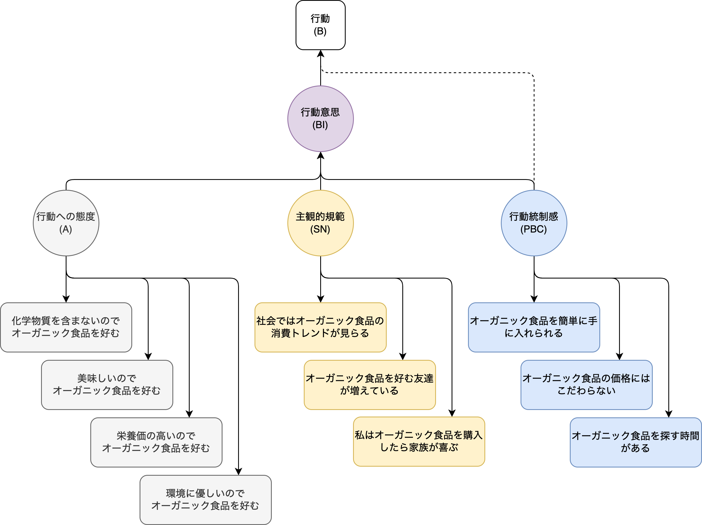

```{r load_packages, message=FALSE, warning=FALSE, include=FALSE} 
library(here)
library(DiagrammeR)
library(knitr)
library(kableExtra)
library(data.table)
library(magrittr)
```

<script src="https://code.jquery.com/jquery-3.7.0.min.js" integrity="sha256-2Pmvv0kuTBOenSvLm6bvfBSSHrUJ+3A7x6P5Ebd07/g=" crossorigin="anonymous"></script>

<script src="script/custom.js"></script>

<!-- Enables HTML tags in nodes -->
<!-- <script>mermaid.initialize({ securityLevel: 'loose' });</script> -->

```{css, echo=FALSE}
slides > backdrop {
  background: white;
}

slides > slide {
  background: linear-gradient(#ffffff, #ffffff 85%, #ffffff);
  background-color: white;
  background-image: none;
}

slides > slide:not(.nobackground):before {
  width: 55px;
  height: 40px;
  background-size: 55px 40px;
}

footer:after {
  font-size: 6pt;
  content: attr(label);
  position: absolute;
  margin-left: auto;
  margin-right: auto;
  left: 0;
  right: 0;
  width: 70%;
  text-align: center;
  bottom: 20px;
  line-height: 1.5;
  display: block;
}
```

## そもそもデータサイエンティストと？

<font size="4">
意思決定者を**データに基づいて**合理的な判断をするよう支援する人
<br><br>
又は、どのソフトウェアエンジニアよりも統計学が得意で、どの統計学者よりもソフトウェアエンジニアリングが得意な人 — [Josh Wills, 2014](https://twitter.com/josh_wills/status/198093512149958656)
</font>
<br><br>
<center>
```{r, echo=FALSE, out.width = "400px"}
knitr::include_graphics("img/data_science_venn_diagram.svg")
```
</center>

# 詳細に入る前に<br>講師の簡単な自己紹介

## 自己紹介

<table class="table">
<tr>
  <td></td>
  <td colspan="2">セルジャン・タハ・アヒ<br>
  1981年トルコ生まれ → 学位：中東工科大学 → 修士：中東工科大学 → 博士：東京工業大学<br>
  2011年〜現在、データサイエンスの領域で働いている</td>
</tr>
<tr>
  <td>赤とオレンジの色合いの家の屋根</td>
  <td>風光明媚なエーゲ海と地中海の海岸線沿いに位置する数多くのリゾート</td>
  <td>歴史的遺跡が豊富</td>
</tr>
<tr>
  <td></td>
  <td></td>
  <td></td>
</tr>
</table>

## 本日のアジェンダ

コンテンツが3つのパートに分かれています

1. データサイエンスの概念
2. 5つのケーススタディ
3. データサイエンスの今後

# Part I: データサイエンスの概念

## ① データサイエンティストと機械学習エンジニアの役割が異なる

<font size="2">
1. 多くの企業がデータサイエンティストと機械学習エンジニアのポジションを同じ意味で使用していますが、実際には期待されるアウトプットが異なるため、両方は**異なる職業**です。<br>
2. データサイエンティストの主なアウトプットが意思決定者を納得させるための**プレゼンテーション資料**で、機械学習エンジニアの主なアウトプットが**ソフトウェア**になります。<br>
3. 意思決定者を納得させるためには、品質の高いプレゼンテーション資料が不可欠です。そのため、データサイエンティストが所属する企業の**ビジネスをきちんと理解する**必要があります。<br>
4. データサイエンティストも機械学習エンジニアもコードを書きますが、商用のソフトウェアを開発するのは主に機械学習エンジニアの役割です。そのため、機械学習エンジニアは**コーディングのスキル**が求められます。<br>
5. 本日は、**データサイエンティスト**の職業についてお話しします。<br>
</font>

<table class="table">
  <tr>
    <td><center><br><a href="https://unsplash.com/photos/gMsnXqILjp4"><font size="2">データサイエンティストのイメージ</font></a></center></td>
    <td><center><br><a href="https://unsplash.com/photos/CPs2X8JYmS8"><font size="2">機械学習エンジニアのイメージ</font></a></center></td>
  </tr>
</table>

## ① データサイエンティストと機械学習エンジニアの役割が異なる

<center>
```{r, echo=FALSE}
fname <- here::here("mermaid", "ds_vs_ml.mmd")

DiagrammeR::mermaid(
  diagram = paste(readLines(fname), collapse="\n"),
  height = "60%",
  width = "60%")
```
</center>

## ② データサイエンティストのプレゼンテーション資料は解決のごく一部に過ぎない

<center>

</center>

## ③ 羅生門効果がデータサイエンスにもある

<div class="alert alert-warning">
羅生門効果とは、一つの出来事において、人々がそれぞれに見解を主張すると矛盾してしまう現象のこと
</div>

データサイエンスにおける羅生門効果とは、同じデータセットの異なる解釈や分析によって対照的な、あるいは矛盾した結論が導き出されること。

<center>

<br>
<font size="3">
羅生門効果は、黒澤明監督の映画「羅生門」で名付けられる
</font>
</center>

## ④ オッカムの剃刀を忘れずに業務する必要がある

<div class="alert alert-warning">
オッカムの剃刀とは、ある事柄を説明する際には必要以上に多くの仮定をすべきではないという指針
</div>

データサイエンスにおけるオッカムの剃刀は、複数の仮説や説明が与えられた場合に、最もシンプルで最も少ない仮説や説明を選ぶ原則です。

<center>

<br>
<font size="3">
オッカムの剃刀は、14世紀の哲学者・神学者のオッカムが多用したことで有名になった
</font>
</center>

## ⑤ 相関関係だけで十分な場合もある

<div class="alert alert-warning">
相関関係は因果関係を意味しないが、行動するためには、相関関係だけで十分な場合がある
</div>

- 相関関係は、2つの変数間の関連性や一緒に変動する傾向を示す
- 因果関係は、ある変数の変化が別の変数に直接的な影響を与える関係

<center>
<font size="3">
相関関係に基づいて行動すべき場合とそうでない場合
</font>
<br>

<br>
<font size="3">
[David Ritter, BCG](https://www.bcg.com/publications/2014/information-technology-future-strategy-david-ritter-when-act-correlation-when-not)
</font>
</center>

# Part II: ケーススタディ

# ① 離脱分析

## 離脱分析（Churn Analysis）とは？

<div class="alert alert-warning">
先ず、分析とは、物事や事象を細かく分けて要素を調べ、新しい情報を得ることです
</div>

- 離脱分析とは、顧客がサービスや製品の利用を中止し、離脱する要因を分析することです</td>
- 離脱分析は、顧客の維持やロイヤリティの向上を目指します</td>
- 離脱リスクの予測やリテンション施策の開発に役立ちます</td>
- この分析には、データの収集、顧客行動のモデリング、要因の特定、予測モデルの構築などが含まれます</td>

## ビジネス課題：離脱分析によるサービス改良

<div class="alert alert-warning">
**タスク**: 顧客の離脱を防止し維持する方法を提案してください
</div>

- 顧客満足度の向上及び離脱の予防は、企業にとって重要な経営目標です
- それの理由が主に二つあります

    1. 新規顧客を獲得するには、既存の顧客を維持するよりも費用がかかります
    2. 新規顧客の収益は既存顧客よりも少ないです

## ステップ 1/4：属性行列の構成を決める

<table class="table">
<tr>
  <th align="center">#</th>
  <th align="left">カテゴリー</th>
  <th align="left">関連属性</th>
</tr>
<tr>
  <td align="center">1</td>
  <td align="left">顧客に関する基礎情報</td>
  <td align="left">年齢、性別、配偶者の有無、職業、住所など</td>
</tr>
<tr>
  <td align="center">2</td>
  <td align="left">サービス利用情報</td>
  <td align="left">月額料金、通話時間、データパッケージ量など</td>
</tr>
<tr>
  <td align="center">3</td>
  <td align="left">契約内容</td>
  <td align="left">契約期間、加入プランなど</td>
</tr>
<tr>
  <td align="center">4</td>
  <td align="left">コールセンターとの連絡</td>
  <td align="left">苦情の件数、フィードバック内容など</td>
</tr>
<tr>
  <td align="center">5</td>
  <td align="left">テニュア</td>
  <td align="left">離脱履歴があるか、登録してから経った期間など</td>
</tr>
<tr>
  <td align="center">6</td>
  <td align="left">利用パターン</td>
  <td align="left">利用の多い時間帯、送信メール件数、受信電話回数など</td>
</tr>
<tr>
  <td align="center">7</td>
  <td align="left">ソーシャルメディアの感情</td>
  <td align="left">Twitter上の感情分析結果、口コミサイトの感情分析結果など</td>
</tr>
<tr>
  <td align="center">8</td>
  <td align="left">競合相手に関する情報</td>
  <td align="left">A社への乗り換え履歴があるか、B社への乗り換え履歴があるかなど</td>
</tr>
</table>

## ステップ 2/4：属性行列を作成する

<table class="table">
  <tr>
    <th align="center">#</th>
    <th align="center">顧客ID</th>
    <th align="right">年齢</th>
    <th align="center">性別</th>
    <th align="right">料金</th>
    <th align="center">加入プラン</th>
    <th align="center">インターネットプラン</th>
    <th align="right">苦情件数</th>
    <th align="center">離脱者</th>
  </tr>
  <tr>
    <td align="center">1</td>
    <td align="center">7887</td>
    <td align="right">18</td>
    <td align="center">男性</td>
    <td align="right">100.29</td>
    <td align="center">家族プラン</td>
    <td align="center">1Gbps</td>
    <td align="right">3</td>
    <td align="center">Yes</td>
  </tr>
  <tr>
    <td align="center">2</td>
    <td align="center">1140</td>
    <td align="right">68</td>
    <td align="center">女性</td>
    <td align="right">29.55</td>
    <td align="center">法人プラン</td>
    <td align="center">WiFi</td>
    <td align="right">1</td>
    <td align="center">No</td>
  </tr>
  <tr>
    <td align="center">3</td>
    <td align="center">8741</td>
    <td align="right">20</td>
    <td align="center">女性</td>
    <td align="right">73.83</td>
    <td align="center">家族プラン</td>
    <td align="center">無し</td>
    <td align="right">0</td>
    <td align="center">No</td>
  </tr>
  <tr>
    <td align="center">4</td>
    <td align="center">3359</td>
    <td align="right">41</td>
    <td align="center">男性</td>
    <td align="right">116.73</td>
    <td align="center">家族プラン</td>
    <td align="center">WiFi</td>
    <td align="right">1</td>
    <td align="center">No</td>
  </tr>
  <tr>
    <td align="center">5</td>
    <td align="center">8557</td>
    <td align="right">20</td>
    <td align="center">男性</td>
    <td align="right">37.51</td>
    <td align="center">法人プラン</td>
    <td align="center">10Gbps</td>
    <td align="right">1</td>
    <td align="center">Yes</td>
  </tr>
</table>
<center>
.<br>
.<br>
.
</center>

## ステップ 3/4：決定木を学習する

<center>
```{r, echo=FALSE, out.width = "800px"}

```
</center>

## ステップ 4/4：結果を解釈し、防止施策を策定する

<table class="table">
  <tr>
    <th align="left">#</th>
    <th align="left">対策方法</th>
  </tr>
  <tr>
    <td>1</td>
    <td>サービスや製品において問題となる可能性のある部分を改善する</td>
  </tr>
  <tr>
    <td>2</td>
    <td>パーソナライズされたエクスペリエンスを提供する</td>
  </tr>
  <tr>
    <td>3</td>
    <td>ロイヤルティプログラムを導入する</td>
  </tr>
  <tr>
    <td>4</td>
    <td>顧客からのフィードバックを定期的に求める</td>
  </tr>
  <tr>
    <td>5</td>
    <td>他社と協力して顧客が喜ぶ可能性のあるコラボレーションを行う</td>
  </tr>
  <tr>
    <td>6</td>
    <td>など</td>
  </tr>
</table>

## Fun Fact about 離脱防止施策

<div class="alert alert-warning">
<font size="3">
心理学には「単純計測効果」という理論がある。その理論によれば、消費やオンラインサービス利用の全般に関してアンケートに回答すると回答しているうちに、対象の商品やサービスを好ましく感じて、購入・消費・利用意欲が高まる効果があるとされている。
</font>
</div>

<table class="table">
  <tr>
    <td><center></center></td>
    <td><center></center></td>
  <tr>
  <tr>
    <td><center>Morwitz and Fitzsimons, 2004</center></td>
    <td><center>Burez and Poel, 2007</center></td>
  </tr>
</table>

# ② 放送時間の最適化

## TV番組の放送時間の最適化による視聴量の増加

<div class="alert alert-warning">
**タスク**: 放送サービスの視聴量を増やすための方法を提案してください
</div>

$$
視聴量 = 視聴者人数 \times 一人あたりの視聴量
$$

```{r, echo=FALSE}
fname <- here::here("mermaid", "viewers.mmd")

DiagrammeR::mermaid(
  diagram = paste(readLines(fname), collapse="\n"),
  height = "80%",
  width = "80%")
```

## TV番組の放送時間の最適化による視聴量の増加

<table class="table">
  <tr>
    <th align="left">時間帯　</th>
    <th align="left">月曜日</th>
    <th align="left">火曜日</th>
    <th align="left">水曜日</th>
    <th align="left">木曜日</th>
    <th align="left">金曜日</th>
  </tr>
  <tr>
    <td>8:00-12:00</td>
    <td>The Big Bang Theory</td>
    <td>Friends</td>
    <td>Grey's Anatomy</td>
    <td>Breaking Bad</td>
    <td>The Office</td>
  </tr>
  <tr>
    <td>12:00-13:00</td>
    <td>Game of Thrones</td>
    <td>Stranger Things</td>
    <td>NCIS</td>
    <td>The Walking Dead</td>
    <td>Black Mirror</td>
  </tr>
  <tr>
    <td>13:00-15:00</td>
    <td>Law & Order: SVU</td>
    <td>The Crown</td>
    <td>CSI: Crime Scene Investigation</td>
    <td>How to Get Away with Murder</td>
    <td>Money Heist</td>
  </tr>
  <tr>
    <td>15:00-17:00</td>
    <td>The Simpsons</td>
    <td>Friends</td>
    <td>Grey's Anatomy</td>
    <td>The Big Bang Theory</td>
    <td>Breaking Bad</td>
  </tr>
  <tr>
    <td>17:00-19:00</td>
    <td>Stranger Things</td>
    <td>The Office</td>
    <td>Black Mirror</td>
    <td>Game of Thrones</td>
    <td>The Crown</td>
  </tr>
  <tr>
    <td>19:00-21:00</td>
    <td>NCIS</td>
    <td>Money Heist</td>
    <td>Law & Order: SVU</td>
    <td>The Walking Dead</td>
    <td>CSI: Crime Scene Investigation</td>
  </tr>
  <tr>
    <td>21:00-24:00</td>
    <td>How to Get Away with Murder</td>
    <td>The Big Bang Theory</td>
    <td>Grey's Anatomy</td>
    <td>Friends</td>
    <td>Breaking Bad</td>
  </tr>
</table>

## 遺伝的アルゴリズムで最適化が可能に

<center></center>

# ③ 事業拡大計画の策定

## ビジネス課題：事業拡大計画の策定

<div class="alert alert-warning">
<font size="3">
**タスク**: 企業として、既存のお客様との距離を最小限に抑えたい。賃貸料や将来の販売予測などを考慮しながら、具体的にどのオフィスを借りるべきかを決めてください。
</font>
</div>

<center></center>

## ビジネス課題：事業拡大計画の策定

```{r store_location_planning, echo=FALSE, as.is=TRUE}
DT <- fread(here::here("docs", "bip.csv"))

DT %>%
  knitr::kable(align = "r", format.args = list(big.mark = ",", scientific = FALSE)) %>%
  kable_styling(font_size = 8)
```

## 数理最適化はこの課題の解決に適している

数理最適化は、与えられた<b>条件</b>と<b>選択肢</b>に基づいて最適な要素を選ぶ方法

```{r, echo=FALSE}
fname <- here::here("mermaid", "optimization.mmd")

DiagrammeR::mermaid(
  diagram = paste(readLines(fname), collapse="\n"),
  height = "90%",
  width = "100%")
```

## 数理最適化に様々な応用がある

<table class="table">
  <tr>
    <td>ルート配送問題（物流業界）</td>
    <td><center></center></td>
  </tr>
  <tr>
    <td>ポートフォリオ最適化（金融業界）</td>
    <td><center></center></td>
  </tr>
  <tr>
    <td>従業員シフトスケジューリング最適化（サービス業界）</td>
    <td><center></center></td>
  </tr>
</table>

# ④ 顧客支出の向上

## 行動科学とは？

- 人々の行動や心理的なプロセスを科学的に研究する学問領域
- これには心理学、社会学、経済学などが含まれる<br>
- 行動科学の目的は、人々の行動や意思決定のメカニズムを理解し、それを応用して個人や組織の行動を予測・変容させること

## ビジネス課題：顧客の支出に対する障壁の特定

<div class="alert alert-warning">
**タスク**: 購入の障壁を予測し、その障壁を取り除く販促政策を策定してください
</div>

<table class="table">
  <tr>
    <td width="280">オーガニック食品を販売している会社の<br>観点から考える<br><br>
    1. 計画的行動理論を元に要因を考える<br>
    2. アンケートを実施<br>
    3. 共分散構造分析（SEM）を実行<br>
    4. モデルの確認<br>
    5. 結論を抽出し、政策を策定
    </td>
    <td><center></center></td>
  <tr>
</table>

# ⑤ ネットワーク分析

## ネットワーク分析とは？

- データ間の相互関係をグラフとして表現し、ノード（要素）とエッジ（関係）の特性やパターンを解析する手法
- これにより、複雑なデータの関係性や重要な要素の特定、情報の伝播や影響力の理解などが可能となる

```{r network_analysis, echo=FALSE, as.is=TRUE}
mygraph <-
  create_graph() %>%
  add_pa_graph(n = 15, m = 1, set_seed = 23) %>%
  add_gnp_graph(n = 15, p = 0.05, set_seed = 23) %>%
  join_node_attrs(df = get_betweenness(.)) %>%
  join_node_attrs(df = get_degree_total(.)) %>%
  colorize_node_attrs(
    node_attr_from = total_degree,
    node_attr_to = fillcolor,
    palette = "Blues",
    alpha = 80
  ) %>%
  rescale_node_attrs(
    node_attr_from = betweenness,
    to_lower_bound = 0.5,
    to_upper_bound = 0.5,
    node_attr_to = height
  ) %>%
  select_nodes_by_id(nodes = get_articulation_points(.)) %>%
  set_node_attrs_ws(node_attr = peripheries, value = 2) %>%
  set_node_attrs_ws(node_attr = penwidth, value = 3) %>%
  clear_selection() %>%
  set_node_attr_to_display(attr = NULL)

suppressWarnings({render_graph(mygraph, layout = "nicely")})
```

## ビジネス課題：ソーシャル・ネットワーク運用の改善

<table class="table">
  <tr>
    <td><center><font size="3">1、7、8番のユーザの年代（10代、40代、70代）を予測してください</font></center></td>
    <td><center><font size="3">夫婦だろうと思われるノード（頂点）ペアを予測してください</font></center></td>
  </tr>
  <tr>
    <td><center></center></td>
    <td><center></center></td>
  <tr>
</table>

# Part III: データサイエンスの今後

## 業務で利用するツールが頻繁に進化し続ける

私（サンプル１ですが）の経験から考えると・・・

```{r, echo=FALSE}
fname <- here::here("mermaid", "tooling_timeline.mmd")

DiagrammeR::mermaid(
  diagram = paste(readLines(fname), collapse="\n"),
  height = "100%",
  width = "100%")
```

## ChatGPT（生成系AI）時代におけるデータサイエンス

<table class="table">
  <tr>
    <th align="left">#</th>
    <th align="left">何が変わったの？</th>
    <th align="left">それはなんで大事？</th>
  </tr>
  <tr>
    <td>1</td>
    <td>AlexaやSiriのようなデジタルアシスタントの改善版を作ることが可能になりました</td>
    <td>データサイエンティストが高度な質問応答システムを作れるようになりました</td>
  </tr>
  <tr>
    <td>2</td>
    <td>ラベル付きデータの自動生成が可能にになりました</td>
    <td>データサイエンティストがデータの提供を待つ時間が減りました</td>
  </tr>
  <tr>
    <td>3</td>
    <td>人工的な市場やビジネス調査を行えるようになりました</td>
    <td>データサイエンティストが自分で市場やビジネスをある程度理解できるようになりました</td>
  </tr>
</table>

# Thank you
